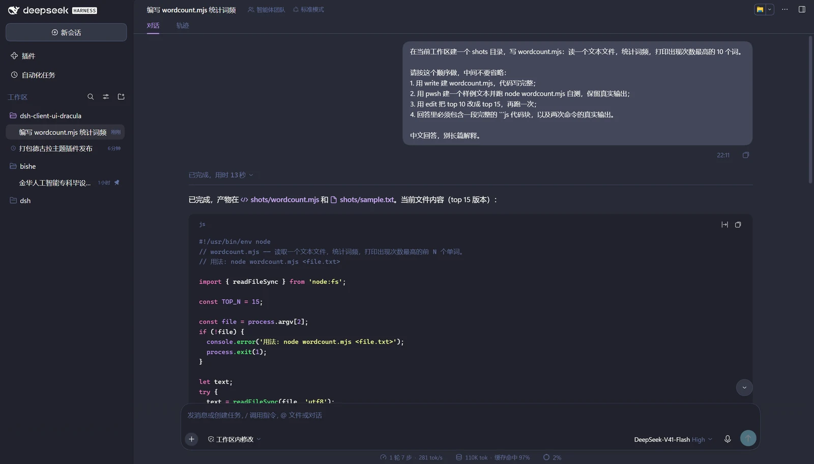
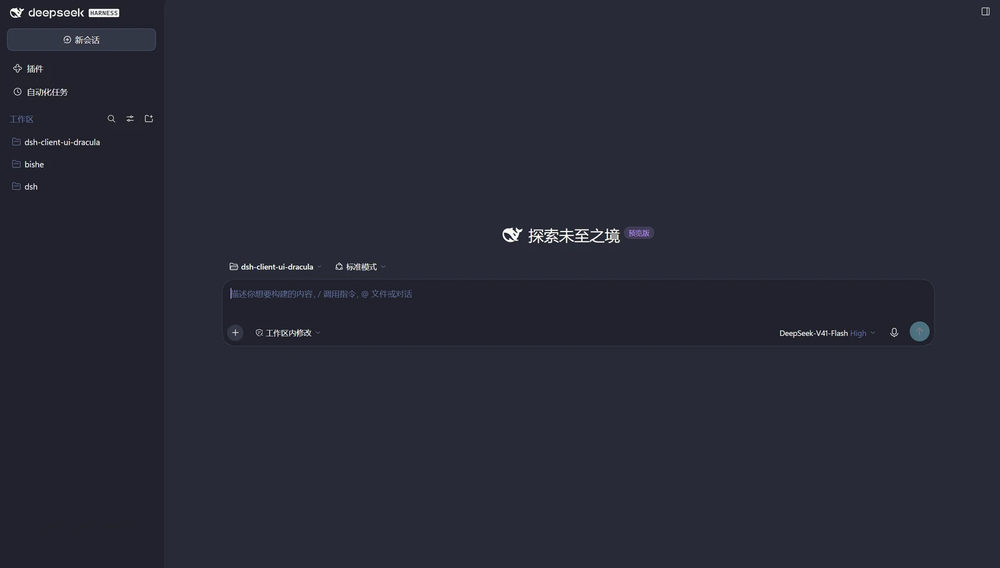
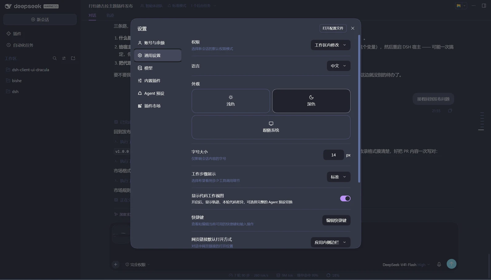
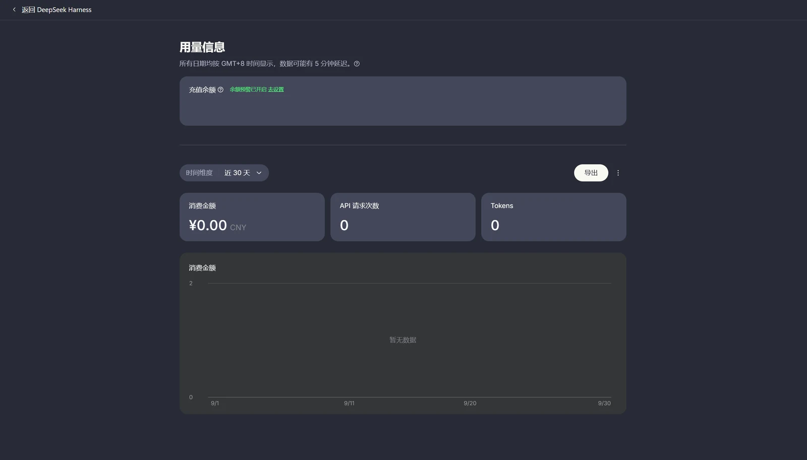

# dsh-client-ui-dracula

A [Dracula](https://draculatheme.com/) theme for the DeepSeek Harness web UI — the same palette VS Code ships. The code surfaces and the type scale got some attention too.

[中文说明](README.md)

```
Background #282a36   Current line / bubble #44475a   Foreground #f8f8f2   Comment #6272a4
Cyan #8be9fd   Green #50fa7b   Orange #ffb86c   Pink #ff79c6   Purple #bd93f9   Red #ff5555   Yellow #f1fa8c
```

Dark mode only. Switch Appearance back to light and you get the shipped palette — no pale purple on white.

## What it changes

Instead of patching selectors one by one, the sheet re-points the product's own semantic colour tokens (`--dsw-*`, `--shiki-*`, `--json-tree-*`) at the Dracula palette. Pages, cards, overlays, borders, labels, brand and state colours, code blocks, inline code, syntax highlighting, the JSON tree, scrollbars, selection and the file-diff view all follow — and the product's own judgements about which surface sits above which are left intact, only the colours move.

The typography got a few changes of its own:

- programming font stacks for code and UI (Cascadia Mono / Segoe UI Variable Text by default), with CJK falling back to YaHei / PingFang
- one step tighter on the type scale, with slightly shorter line heights
- the reading column goes from the shipped 748px to 1080px
- code blocks scroll instead of wrapping. The shipped rule is `pre-wrap` + `break-all`, which cuts long identifiers in half
- a taller tool-output area, and 12px scrollbars

All of it is one stylesheet, injected as `<style data-plugin="dsh-client-ui-dracula">`, every rule scoped to `:root[data-dracula="on"]`. Drop that attribute and the page is back to stock immediately — no reload, no restart.

## Screenshots



*A conversation. Syntax highlighting, the code-block surface, bubbles and the reading column — where most of the work went.*



*Home and sidebar. `#282a36` underneath, purple on the new-session button, selection states and accents.*



*Settings. Because the `--dsw-*` tokens are re-pointed wholesale, toggles, selects, cards and the sidebar selection all move together — no per-selector patches.*

The embedded platform page (part of `extras/`, not a plugin) uses the same palette:



## Install

The package declares `dsh.bundle.patch`. Once it is installed and listed in `dsh.profile.bundles`, it inserts its own `ui-dracula` row into the layer stack — there is no `cordis.patch.yml` to hand-edit.

On the desktop the graphical route is the least fuss: Settings → Plugins → **+ Add plugin**, then enter either of these.

| What to enter | Where it comes from |
|---|---|
| `dsh-client-ui-dracula` | npm, with the China mirror as the install source. The package is [on npm](https://www.npmjs.com/package/dsh-client-ui-dracula) |
| `https://github.com/Erbsen16/dsh-client-ui-dracula` | the GitHub source archive, no npm involved |

If nothing changes after installing, check that `dsh-client-ui-dracula` is in the profile's `dsh.profile.bundles`. On my own install the official manager added the dependency but not the bundle row, and this plugin only inserts `ui-dracula` once it is treated as a bundle. Add the line and the HMR pass picks it up; otherwise restart the host.

For profiles other than `desktop`, use the CLI:

```powershell
dsh plugin --profile web add dsh-client-ui-dracula                    # from npm
dsh plugin --profile web add github:Erbsen16/dsh-client-ui-dracula    # from GitHub
```

`dsh plugin` is a thin pnpm passthrough, so any source pnpm understands works: an npm name, `github:user/repo`, a tarball URL, a local directory.

The `desktop` profile is owned by the host, and the CLI refuses to touch it (`profile "desktop" is managed exclusively by the Electron application`). A manual install looks like this:

```powershell
cd $env:USERPROFILE\.dsh\profiles\desktop
pnpm add github:Erbsen16/dsh-client-ui-dracula
# then add "dsh-client-ui-dracula" to dsh.profile.bundles in that directory's package.json
```

This plugin is not in the DSH plugin market yet. The market only installs sources listed in [awesome-dsh-plugin](https://github.com/awesome-dsh-plugin/awesome-dsh-plugin); getting listed means opening an entry PR there.

## Tuning

Section 0 of `lib/client.js` holds the three variables:

```js
'--dracula-content-width: 1080px;'                    // reading and composer column, 748px stock
'--dracula-code-font: "Cascadia Mono", ...';          // programming font
'--dracula-ui-font: "Segoe UI Variable Text", ...';   // UI font — use var(--dracula-code-font) for all-monospace
```

Saving is enough; the client HMR pass reloads the stylesheet into every open page.

To compare side by side, `__dracula.set(false)` in the DevTools console reverts, `set(true)` brings it back.

## Uninstall

Drop the package name from `dsh.profile.bundles`, run `pnpm remove dsh-client-ui-dracula`, restart the host.

## extras: the embedded platform page

Settings → Account & balance → Usage opens a remote `platform.deepseek.com` document. Its styles are generated at runtime with hashed class names, out of reach of anything on the DSH side.

`extras/platform-purple/` takes the other route: it patches the preload inside `app.asar`, walks the DOM remapping each element's computed colours onto the Dracula palette while preserving relative luminance and contrast, and re-runs on every React re-render through a MutationObserver.

It is not a plugin, the plugin manager cannot install it, and a host upgrade overwrites `app.asar` — an unofficial modification used at your own risk. See [extras/platform-purple/README.md](extras/platform-purple/README.md).

## Files

```
lib/client.js        browser half — the single stylesheet
lib/index.js         host half — a no-op so dsh.client is visible to the Loader
cordis.patch.yml     bundle patch
scripts/smoke.mjs    npm test — smoke test over a DOM stub, no dependencies
docs/                screenshots used by these READMEs
extras/              the platform-page recolour patch, not a plugin
```

## Compatibility

Written against the DSH 0.2.0-rc.2 / 0.1.7-rc.2 frontend. The sheet's main channel is the product's CSS variables (`--dsw-*`, `--shiki-*`, `--json-tree-*`), which is stable; a handful of rules name hashed CSS-module classes (`.wSkVaW_root`, `._Xvjua_body`, …), and a DSH upgrade that renames them simply loses those refinements — nothing errors, that part just falls back to the shipped styles.

## License

[MIT](LICENSE). Palette from [Dracula Theme](https://draculatheme.com/), also MIT.
