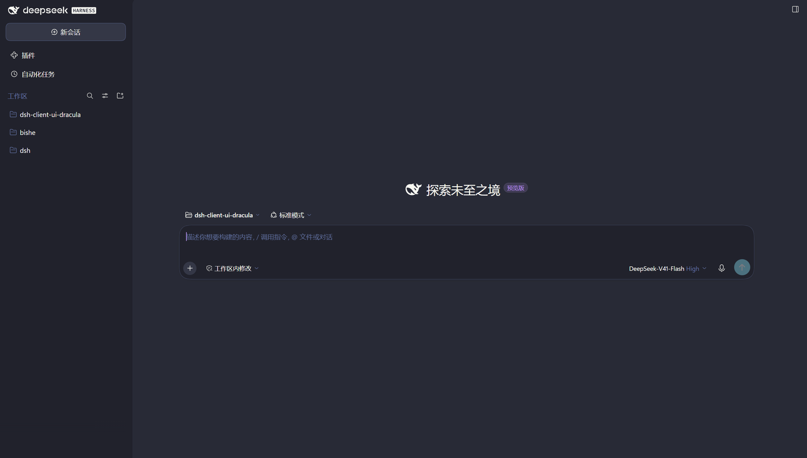
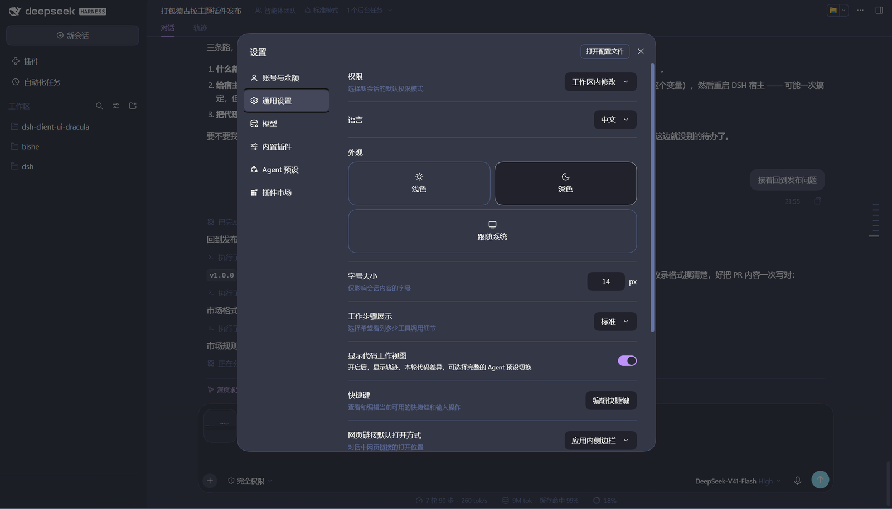
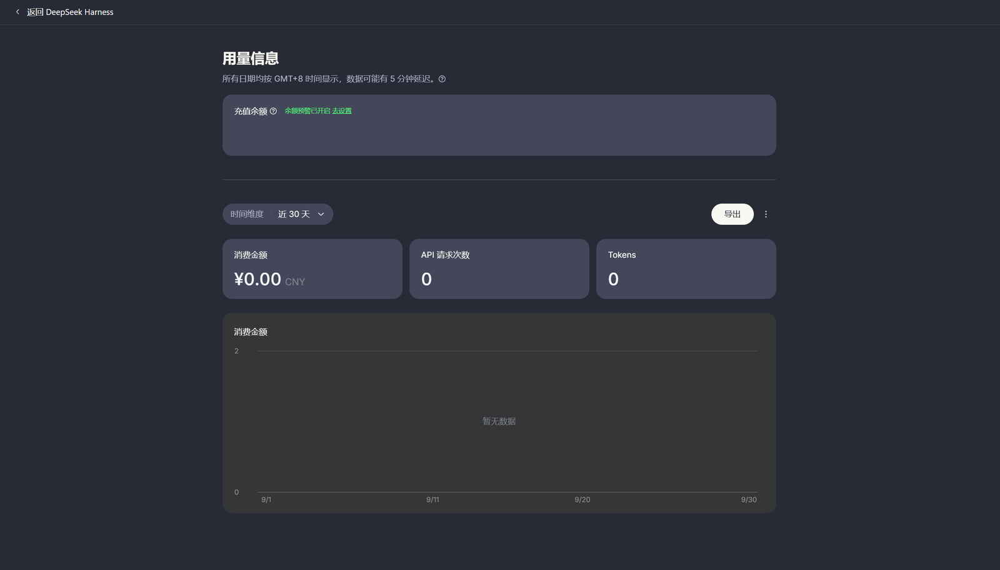

# dsh-client-ui-dracula

**A Dracula dark theme for the DeepSeek Harness Web GUI** — the VS Code "vampire" palette, plus a set of programmer-oriented typography refinements.

[中文说明](README.md)

```
Background #282a36 · Current line / bubble #44475a · Foreground #f8f8f2 · Comment #6272a4
Cyan #8be9fd · Green #50fa7b · Orange #ffb86c · Pink #ff79c6 · Purple #bd93f9 · Red #ff5555 · Yellow #f1fa8c
```

Colours come from [VS Code's Dracula theme](https://draculatheme.com/) (MIT). **Dark mode only** — switching Appearance back to light still gives the shipped, legible palette.

## What it changes

| Scope | Content |
|---|---|
| Palette (`lib/client.js`, sections 11–12) | Page, cards, overlays, borders, labels, brand/accent, state colours, code blocks and inline code, syntax highlighting (shiki tokens), the JSON tree, scrollbars, selection, file-diff backgrounds, onboarding gradients — all re-pointed to Dracula |
| Typography (sections 0–10) | Monospace code face and UI face, a tighter type scale, a 1080px content column, code blocks that scroll instead of re-wrapping, taller tool output, 12px scrollbars |

There is exactly one stylesheet, injected as `<style data-plugin="dsh-client-ui-dracula">`, and every rule hangs off `:root[data-dracula="on"]` — so the page can be reverted whole at any moment.

## Screenshots



*Home and sidebar: `#282a36` page, purple accents on the new-session button and selection states.*



*Settings: the `--dsw-*` tokens are re-pointed wholesale, so toggles, selects, cards and the sidebar selection all follow — not a stack of per-selector patches.*

The embedded platform page (`extras/platform-purple`, not a plugin) is remapped onto the same palette:



## Install

The package ships its own `dsh.bundle.patch`: once installed and listed in `dsh.profile.bundles`, it inserts itself into the profile's layer stack — no hand-written `cordis.patch.yml` row needed.

### Desktop (Electron, the `desktop` profile)

The desktop profile is owned by the host, so the CLI refuses to touch it (`profile "desktop" is managed exclusively by the Electron application`). Use the host's plugin manager, or install by hand:

```powershell
# 1) install into the desktop profile
cd $env:USERPROFILE\.dsh\profiles\desktop
pnpm add github:Erbsen16/dsh-client-ui-dracula

# 2) add "dsh-client-ui-dracula" to dsh.profile.bundles in that directory's package.json

# 3) restart the host
```

### Other profiles (`web` / `tui` / your own)

```powershell
dsh plugin --profile web add github:Erbsen16/dsh-client-ui-dracula
```

`dsh plugin` is a thin pnpm passthrough, so any source pnpm understands works: an npm name, `github:user/repo`, a tarball URL, a local path.

### Plugin market

The DSH market only installs sources listed in the curated [awesome-dsh-plugin](https://github.com/awesome-dsh-plugin/awesome-dsh-plugin) registry; to be listed, open a PR adding one entry there.

## Tuning

Section 0 of `lib/client.js` holds the three knobs:

```js
'--dracula-content-width: 1080px;'   // reading/composer column (the shipped value is 748px)
'--dracula-code-font: "Cascadia Mono", ...';  // programming font
'--dracula-ui-font: "Segoe UI Variable Text", ...';  // UI font — use var(--dracula-code-font) for an all-monospace UI
```

Saving the file hot-reloads the stylesheet into every open page; no refresh needed.

Live switch (DevTools console): `__dracula.set(false)` reverts, `__dracula.set(true)` re-applies.

## Uninstall

Drop the package name from `dsh.profile.bundles`, `pnpm remove dsh-client-ui-dracula`, restart the host.

## Relation to `dsh-client-ui-devtune`

This plugin was extracted from the author's working `dsh-client-ui-devtune` setup: the same stylesheet, with every identifier (package name, the `data-dracula` switch, the `__dracula` global) renamed. Installing both is harmless — each injects a near-identical sheet — but pointless; keep one.

## extras/platform-purple

The embedded DeepSeek platform page (Settings → Account & balance → Usage) is a remote `platform.deepseek.com` document whose styles are generated at runtime with hashed class names, out of reach of any DSH-side stylesheet. `extras/platform-purple/` patches the preload inside `app.asar` instead: it walks the DOM and remaps each element's computed colours onto the Dracula palette (preserving relative luminance and contrast), re-running on every React re-render.

It is **not a plugin** — the plugin manager cannot install it, a host upgrade overwrites `app.asar`, and it is an unofficial modification used at your own risk. See [extras/platform-purple/README.md](extras/platform-purple/README.md).

## Layout

```
lib/client.js              browser half: the single stylesheet
lib/index.js               host half: a no-op row so dsh.client is seen by the Loader
cordis.patch.yml           bundle patch: inserts the ui-dracula row
scripts/smoke.mjs          npm test: dependency-free smoke test over a DOM stub
docs/                      screenshots used by the READMEs
extras/platform-purple/    optional: recolours the embedded platform page (patches app.asar)
```

## Compatibility

Built against the frontend of **DSH 0.2.0-rc.2 / 0.1.7-rc.2**. The stylesheet's main channel is the product's CSS variables (`--dsw-*`, `--shiki-*`, `--json-tree-*`), which is stable; a few rules name hashed CSS-module classes (`.wSkVaW_root`, `._Xvjua_body`, …) that a DSH upgrade may rename — those refinements would silently stop applying, and nothing breaks.

## License

[MIT](LICENSE). Palette by [Dracula Theme](https://draculatheme.com/) (MIT).
